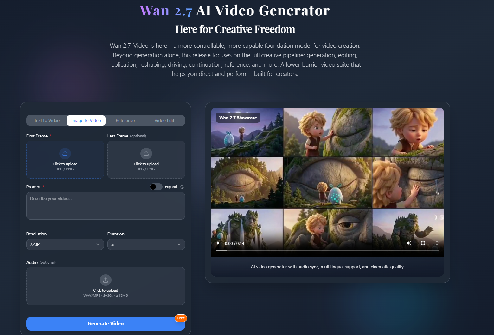

# Wan 2.7




## Overview

[Wan 2.7](https://www.jxp.com/wan/wan-2-7) focuses on faster cinematic video creation with a lighter workflow.

Wan 2.7 is useful when creators and teams want to turn prompts and early concepts into more presentable video drafts for storyboarding, product storytelling, and rapid iteration.

## Why This Format Works On GitHub

- Clear public landing page with persistent history
- - Easy to show product context, screenshots, and examples together
  - - Better for repeatable updates than a one-off short post
   
    - ## Example Workflow
   
    - ```bash
      idea -> storyboard -> prompt -> multi-shot render -> review -> publish
      ```

      ## Prompt Example

      ```text
      Create a cinematic product teaser with two scene transitions, soft camera motion, realistic lighting, and synced ambient audio.
      ```

      ## Product Link

      Explore the official [Wan 2.7 product page](https://www.jxp.com/wan/wan-2-7) for the full workflow, latest examples, and current capabilities.
      
